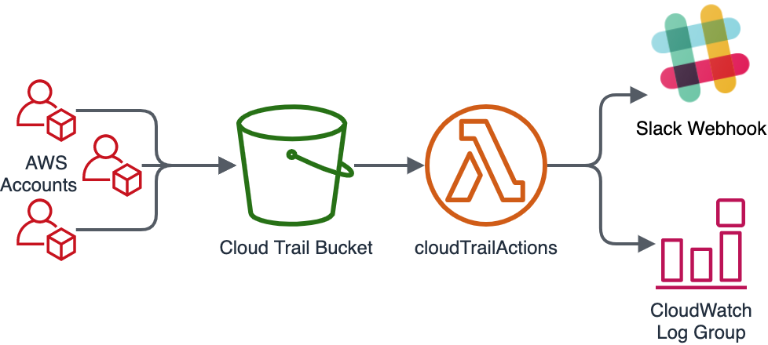
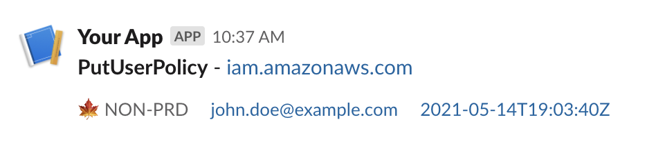

# CloudTrail Console Actions

_**Problem:**_ CloudTrail signal to noise ratio is too noisy for a human to understand. This Lambda's goal is to find actionable events and alert/log them to cloudwatch or Slack.

## Installation

**NOTE: At the time of this writing, the `go1.x` Lambda environment does not support `arm64` architectures.**

AWS Lambda accepts a `.zip` file of a built golang binary, as long as it is built for the Lambda default environment for Golang of Linux and AMD64.  You can clone this repo and simply use the included [`Makefile`](./Makefile) to build the package.

```shell
git clone git@github.com:Techcadia/cloudtrail-console-actions.git
cd cloudtrail-console-actions
make zip
```

The above commands will output `${GIT_ROOT}/dist/function.zip`.  Make sure to properly specify this path in the Terraform [S3 example](./terraform/example-com_s3#L16) or [SNS example](./terraform/example-com_sns#L22).

If you are not using the included [`Makefile`](./Makefile) in this repo, make sure to use `GOARCH=amd64 GOOS=linux` when building the function.

**NOTE: If AWS has added support for `arm64` for `go1.x` in Lambda functions when you are reading this, make sure to set `architectures` in your Terraform and run `make zip ARCH=arm64` to get the proper binary.**



## Examples

[Event](https://app.slack.com/block-kit-builder/T4BH42T2M#%7B%22blocks%22:%5B%7B%22type%22:%22section%22,%22text%22:%7B%22type%22:%22mrkdwn%22,%22text%22:%22*PutUserPolicy*%20-%20iam.amazonaws.com%22%7D%7D,%7B%22type%22:%22context%22,%22elements%22:%5B%7B%22type%22:%22mrkdwn%22,%22text%22:%22:maple_leaf:%20NON-PRD%22%7D,%7B%22type%22:%22mrkdwn%22,%22text%22:%22john.doe@example.com%22%7D,%7B%22type%22:%22mrkdwn%22,%22text%22:%22%3Chttps://console.aws.amazon.com/cloudtrail/home?region=%25s#/events?EventId=404956a8-8b3a-400e-a180-5b0659d77403%7C2021-05-14T19:03:40Z%3E%22%7D%5D%7D%5D%7D) in Slack



CloudWatch Search terms
```
fields @timestamp, @message
| sort @timestamp desc
| filter msg == "Event"
```
Example Event
```
{
  "account_id": "123456789012",
  "event_id": "ec20d295-2332-4871-9a0c-0f3193119eb6",
  "event_name": "PutUserPolicy",
  "event_source": "iam.amazonaws.com",
  "event_time": "2021-05-14T19:03:40Z",
  "level": "info",
  "msg": "Event",
  "principal": "AIDA123456789EXAMPLE:john.doe@example.com",
  "time": "2021-05-14T19:18:19Z",
  "user_agent": "Mozilla/5.0 (Macintosh; Intel Mac OS X 10_15_7) AppleWebKit/537.36 (KHTML, like Gecko) Chrome/90.0.4430.93 Safari/537.36",
  "user_name": "john.doe@example.com"
}
```

## Environment Reference

The following environmental variables are supported:

* `SLACK_NAME` - (Optional) Specifies the name of the default account events are from.
* `SLACK_CHANNEL` - (Optional) Specifies the Slack Channel to publish events
* `SLACK_WEBHOOK` - (Optional) Specifies the webhook URL to send events to if not set only logs will be emitted.
* `SLACK_NAME_${AWS_ACCOUNT_NUMBER}` - (Optional)  Specifies the name of the account specific event.

*Note:* You can uses Slack Emoji's in `SLACK_NAME` and `SLACK_NAME_*` by using the standard `:maple_leaf:` designation.

Environment Example:

```shell
# SLACK_NAME_${AWS_ACCOUNT_NUMBER}=":emoji: ${ACCOUNT_FRIENDLY_NAME}"
SLACK_NAME_0000000000=":pencil2: audit"
SLACK_NAME_1234567890=":maple_leaf: my-account"
SLACK_NAME_2345654321=":lock: security"
```

## Cost

While you may think that processing every single CloudTrail event with a Lambda function would be costly, this Lambda is extremely efficient and uses streams and buffers to run in record time.  The most expensive part of a Lambda function is the execution time, and with the proper amount of memory allocated to prevent timeouts (see [Timeouts](#timeouts) below if you are experiencing timeouts), this Lambda is VERY cheap to run.

**Example Cost**

In an AWS organization with 15 accounts, about 100 employees with access to the AWS console, and most of the infrastructure built by hand, we see this Lambda run ~100 executions per minute, with an average execution time of 200ms.  Detailed calculations are below, but in the `us-west-2` region, this works out to be about $8 a month.

<!--NOTE: To make the following quote appear on multiple lines, we use two spaces at the end of each line-->

_**Unit conversions**_

> **Number of requests:** 100 per minute * (60 minutes in an hour x 730 hours in a month) = 4380000 per month  
**Amount of memory allocated:** 512 MB x 0.0009765625 GB in a MB = 0.5 GB  
**Amount of ephemeral storage allocated:** 512 MB x 0.0009765625 GB in a MB = 0.5 GB  

_**Pricing calculations**_
> 4,380,000 requests x 200 ms x 0.001 ms to sec conversion factor = 876,000.00 total compute (seconds)  
0.50 GB x 876,000.00 seconds = 438,000.00 total compute (GB-s)  
**Tiered price for:** 438000.00 GB-s  
438000 GB-s x 0.0000166667 USD = 7.30 USD  
**Total tier cost = 7.3000 USD (monthly compute charges)**  
>
4,380,000 requests x 0.0000002 USD = 0.88 USD (monthly request charges)  
0.50 GB - 0.5 GB (no additional charge) = 0.00 GB billable ephemeral storage per function  
7.30 USD + 0.88 USD = 8.18 USD

**Lambda costs - Without Free Tier (monthly): 8.18 USD**

## Tips and Troubleshooting

### Cloudwatch Errors

```
fork/exec /var/task/main: exec format error: PathError null
```

If your Golang binary is not built properly for the Lambda environment, you will receive the above error.  For `go1.x`, AWS only supports `x86_64` Lambda architecture, so make sure to use `GOARCH=amd64` and `GOOS=linux` when building--especially if you are using an M1 Mac.

### Processing Events

Depending on the size of your AWS account / organization, you may receive a LOT of cloudtrail events that need to be processed.  The defaults in the examples in this repository set the Lambda `reserved_concurrent_executions` to 10, but this might not be enough for you.  You can easily check this based on the Monitoring tab of the deployed lambda, and check for Throttling.  If you are seeing a lot of throttling, try increasing this number.  The default limit for an AWS account is 1000 executions, with 100 of those desginated for UnreservedConcurrentExecutions, so the max you can set this to is 900.  **NOTE: Setting this to 900 may throttle other Lambda functions in your environment.**


### Timeouts

The default timeout of a Terraform-created Lambda function (and as such the ones in this repo) is 3 seconds.  If you are noticing timeouts in the Lambda (execution times hitting 3000ms), it is likely due to the default memory defined in this module of 128.  Increase this memory to 256 or 512 and the timeouts should decrease.

Example graph of Lambda timeouts due to memory constraints:


