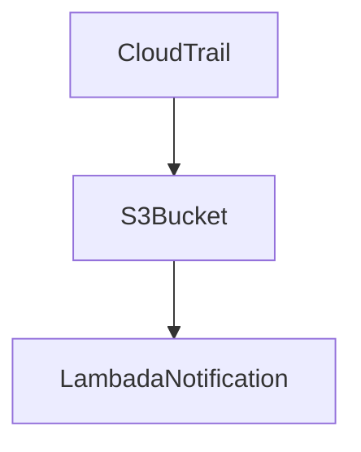
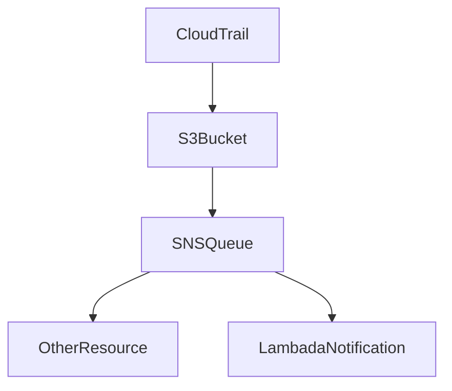

# Terraform Module

The module has been split into two different modules, S3, and SNS.  The reason for this is that each S3 bucket can only have a single S3 bucket notification configuration.  This works for most cases, but if you have requirements to process Cloudtrail events in more than one system, you can use the SNS module, which uses SNS as the event bridge, allowing multiple systems to subscribe to the topic and process the `s3:ObjectCreated*` events.

### S3
[Terraform Module](./modules/cloudtrailconsole/s3), [Example Code](./example_com_s3/README.md) 

**WARNING**: This occupies the only S3 Notification

### SNS
[Terraform Module](./modules/cloudtrailconsole/sns), [Example Code](./example_com_sns/README.md)

