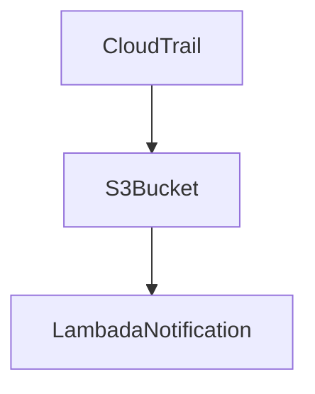
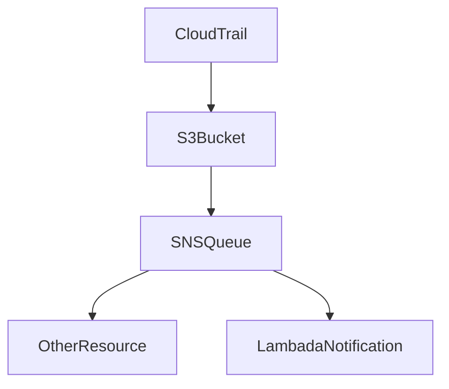

# Terraform Module
The module has been split into two different modules. A simplistic S3 version that should work for most use cases. Where you don't mind having this application occupying the single s3 notification. While the SNS version resolves this by using SNS as the event bridge to allow multiple resources to be notified.

### S3
[Terraform Module](./modules/cloudtrailconsole/s3), [Example Code](./example_com_s3/README.md) 

**WARNING**: This occupies the only S3 Notification

### SNS
[Terraform Module](./modules/cloudtrailconsole/sns), [Example Code](./example_com_sns/README.md)

